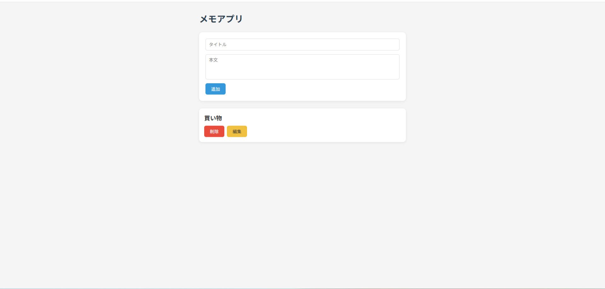

# メモアプリ

## 概要
ReactとSupabaseを使ったフルスタックのメモ管理アプリです。
メモのタイトルと本文をデータベースに保存・管理でき、
追加・編集・削除・一覧表示ができます。
ページを閉じてもデータが保持されます。

## デモ
https://memo-app-one-ruddy.vercel.app/

## 使用技術
- React / Vite
- Supabase（PostgreSQL・クラウドDB）
- Vercel（デプロイ）
- CSS

## 機能
- メモの追加・編集・削除・一覧表示
- データベースへの保存（ページ再読み込み・再起動後もデータを保持）
- editingIdによる編集モードの状態管理（追加・更新ボタンの動的な切り替え）

## 技術的な特徴
- ReactとSupabaseを連携したCRUD操作の実装
- useEffectによる初回データ取得の制御
- 環境変数（.env）によるAPIキーの管理
- テスト設計書の作成・バグ修正・再テストの実施

## テスト
`test-design.md` にテスト設計書を記載しています。
不合格項目のバグ修正と再テストまで実施済みです。

## 制作の背景
Webエンジニアへの転職を目指して学習する中で制作しました。
フロントエンドからデータベース・デプロイまで一貫して体験することを目的としています。

## 今後の展望
- ユーザー認証機能の追加（Supabase Auth）
- タグ・カテゴリによるメモの分類
- 検索・フィルタ機能
- TypeScriptへの移行